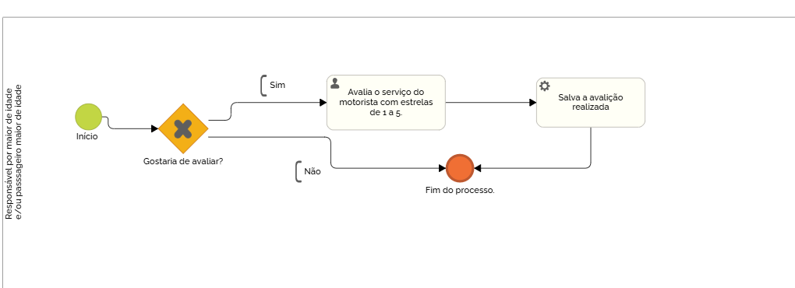

### 3.3.2 Processo 2 – Gestão de avaliações

A avaliação do transporte no dia será uma ferramenta essencial para medir a satisfação dos responsáveis e aprimorar a qualidade do atendimento. Na WiseVan após o motorista confirmar que deixou o passageiro no seu destino, o responsavél pela conta cadastrada receberá uma notificação com a opção de avaliar a experiência do dia, atribuindo uma nota de 1 a 5 estrelas e, em alguns casos, deixando um comentário detalhado.

As avaliações vão ajudar outros usuários a tomar decisões e escolher a van que irá se encaixar no seu perfil. Para os donos de redes de vans está avaliação diária permite que ele identifique pontos fortes e áreas de melhoria. Para garantir avaliações justas, nossa plataforma irá exigir que apenas usuários que realmente utilizaram o serviço possam avaliá-lo. 

Avaliar um serviço de forma clara e honesta contribui para a melhoria contínua da plataforma e para uma experiência mais confiável para todos os usuários.

#### Detalhamento das atividades

O sistema permite que os passageiros faça uma avaliação sobre o serviço realizado pelo motorista, caso deseja fazer a avaliação, o cliente dará uma nota entre 1 a 5 estrelas e tem a opção de enviar observações sobre a sua nota.

### Atividades:  
- **Escolha da ação:** O usuário pode confirmar sua avaliação.  
- **Registro no sistema:** O feedback é salvo e pode ser consultado pelos responsáveis pela gestão do transporte e ajudará na criação do indicador de desempenho do serviço do motorista.  

_Os tipos de dados a serem utilizados são:_

_**Seleção múltipla** - campo com várias opções que podem ser selecionadas mutuamente (tradicional checkbox ou listbox)_
-**Text** - campo para escrever uma mensagem curta ou longa.

**Avaliação**

| **Campo**             | **Tipo**           | **Restrições**         | **Valor default** |
| ---                   | ---                | ---                    | ---               |
| Avaliação             | Seleção múltipla   | Valores de 1 a 5       | Nenhum            |
| Comentário            | Texto              | Nenhum                 | Default           |
| Data da avaliação     | Date               | Nenhum                 | Nenhum            |

| **Comandos**         |  **Destino**                   | **Tipo** |
| ---                  | ---                            | ---               |
| Avaliar              | Inicio do processo de avaliação| Default           |
| Enviar avaliação     | Registra a avaliação           |                   |
| Cancelar             | Inicia o processo de cancelamento|                 |

#### **Tela de  cadastro de avaliação do responsável**

#### **Tela gerencia de avaliação**

