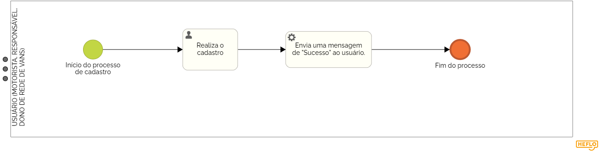
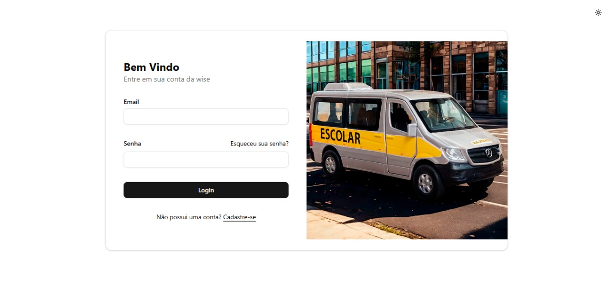
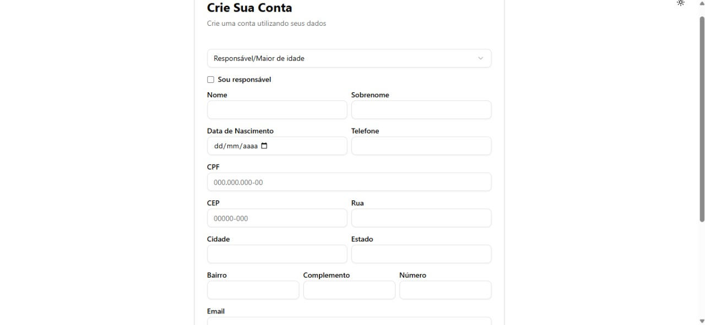
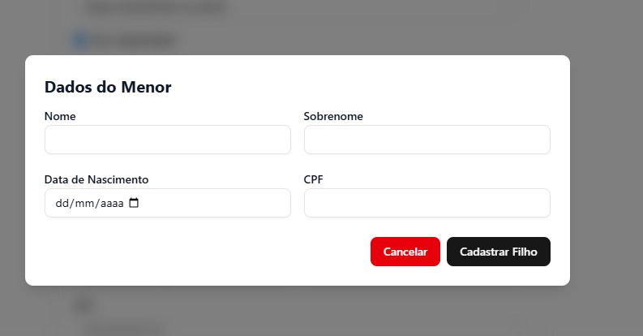
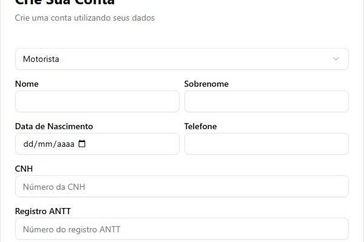
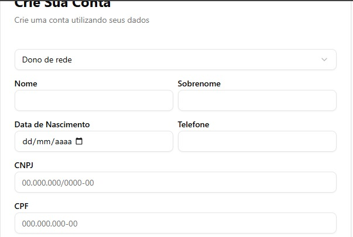
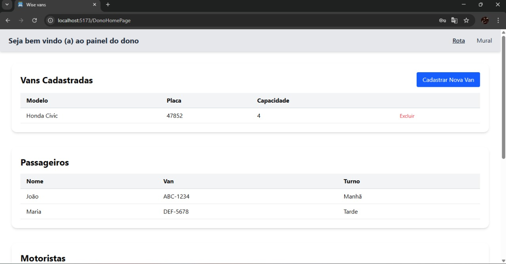
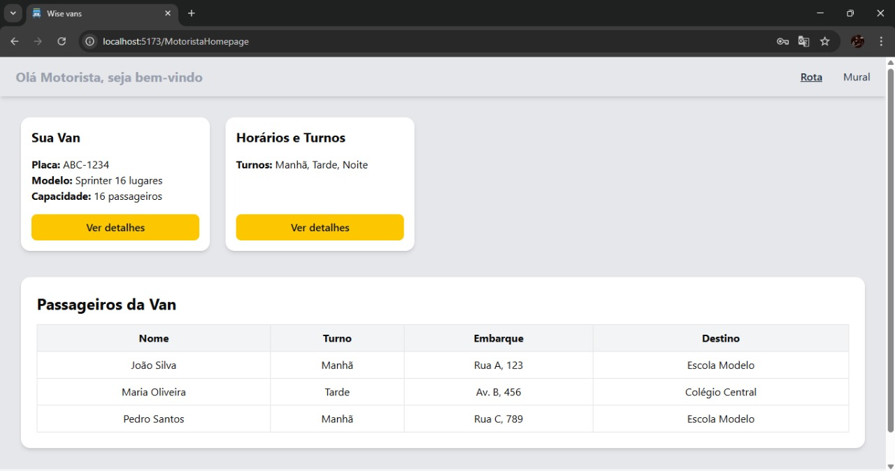
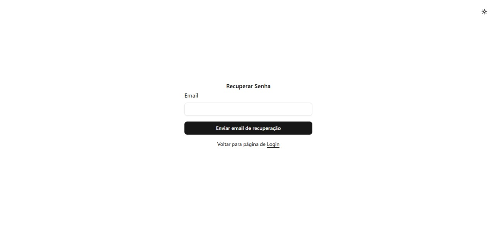

### 3.3.1 Processo 1 – GESTÃO DE CADASTRO

O login e o cadastro são etapas essenciais para acessar sites com segurança. No cadastro, você cria sua conta informando nome, e-mail ou telefone e uma senha forte. Já o login permite acessar sua conta inserindo o e-mail e a senha cadastrados. Caso esqueça a senha, é possível redefini-la pelo e-mail. Para facilitar o acesso, você pode salvar credenciais em um gerenciador de senhas. No sistema de WiseVan teremos três tipo de cadastro, cadastros para responsáveis, motoristas e dono de redes de vans. Caso o passageiro que irá na van seja menor de idade, ele será cadastrado em nome do seu responsável legal.

#### Detalhamento das atividades

Esse processo gerencia o fluxo de cadastro de um usuário no sistema, visando que as informações sejam inseridas e salvas na finalização do processo. 

### Atividades:  
- **Pesquisa de conta:** O sistema verifica se o passageiro já tem um responsável cadastrado.  
- **Ação de decisão:** O usuário pode se cadastrar, caso não tenha login.  

_Os tipos de dados a serem utilizados são:_

_* **Caixa de texto** - campo texto de uma linha_

_* **Número** - campo numérico_

_* **Seleção única** - campo com várias opções de valores que são mutuamente exclusivas (tradicional radio button ou combobox)_

_* **Link** - campo que armazena uma URL_

**Login**

| **Campo**       | **Tipo**         | **Restrições**         | **Valor default** |
| ---             | ---              | ---                    | ---               |
| email           | caixa de texto   | formato de email       |                   |
| senha           | caixa de texto   | mínimo de 8 caracteres |                   |

| **Comandos**         |  **Destino**                                        | **Tipo** |
| ---                  | ---                                                 | ---               |
| Login                | Tela inicial de acordo com o tipo do usuário        | ação              |
| Cadastre - se        | Início do proceso de cadastro                       | ação              |
| Esqueceu senha       | Tela recuperar senha                                | ação              |

**Cadastro Motoristas**

| **Campo**                 | **Tipo**         | **Restrições**               | **Valor default** |
| ---                       | ---              | ---                          | ---               |
| Tipo de usuário           | seleção única    | motorista/dono/resposável    |                   |
| nome                      | caixa de texto   | obrigatório                  |                   |
| sobrenome                 | caixa de texto   | obrigatório                  |                   |
| Data de nascimento        | caixa de data    | formato 00/00/0000           |                   |
| Telefone                  | numero           | mínimo de 10 caracteres      |                   |
| CNH                       | numero           | 10 carecteres                |                   |
| ANTT                      | numero           | 04 carecteres                |                   |
| CPF                       | numero           | 10 carecteres                |                   |
| CEP                       | numero           | 08 carecteres                |                   |
| Rua                       | caixa de texto   | obrigatório                  |                   |
| Cidades                   | caixa de texto   | obrigatório                  |                   |
| Estado                    | caixa de texto   | obrigatório                  |                   |
| Bairro                    | caixa de texto   | obrigatório                  |                   |
| Complemento               | caixa de texto   | obrigatório                  |                   |
| Número                    | caixa de texto   | número                       |                   |
| Email                     | caixa de texto   | formato de email             |                   |
| Senha                     | caixa de texto   | mínimo 08 caracteres         |                   |
| Confirma Senha            | caixa de texto   | mínimo 08 caracteres         |                   |

| **Comandos**         |  **Destino**                   |  **Tipo** |
| ---                  | ---                            |  ---      |
| Registrar            | Encaminha para a tela de login | Ação      |                   
| Entrar com sua conta | Rncaminha para a tela de inicio| Ação      |                   

**Cadastro Dono da Rede**

| **Campo**                 | **Tipo**         | **Restrições**               | **Valor default** |
| ---                       | ---              | ---                          | ---               |
| Tipo de usuário           | seleção única    | motorista/dono/resposável    |                   |
| nome                      | caixa de texto   | obrigatório                  |                   |
| sobrenome                 | caixa de texto   | obrigatório                  |                   |
| Data de nascimento        | caixa de data    | formato 00/00/0000           |                   |
| Telefone                  | numero           | mínimo de 10 caracteres      |                   |
| CNPJ                      | numero           | 10 carecteres                |                   |
| CPF                       | numero           | 10 carecteres                |                   |
| CEP                       | numero           | 08 carecteres                |                   |
| Rua                       | caixa de texto   | obrigatório                  |                   |
| Cidades                   | caixa de texto   | obrigatório                  |                   |
| Estado                    | caixa de texto   | obrigatório                  |                   |
| Bairro                    | caixa de texto   | obrigatório                  |                   |
| Complemento               | caixa de texto   | obrigatório                  |                   |
| Número                    | caixa de texto   | número                       |                   |
| Email                     | caixa de texto   | formato de email             |                   |
| Senha                     | caixa de texto   | mínimo 08 caracteres         |                   |
| Confirma Senha            | caixa de texto   | mínimo 08 caracteres         |                   |

| **Comandos**         |  **Destino**                   |  **Tipo** |
| ---                  | ---                            |  ---      |
| Registrar            | encaminha para a tela de login | Ação      |                   
| Entrar com sua conta | encaminha para a tela de inicio| Ação      |

**Cadastro Responsável / Aluno maior de idade**

| **Campo**                 | **Tipo**         | **Restrições**               | **Valor default** |
| ---                       | ---              | ---                          | ---               |
| Tipo de usuário           | seleção única    | motorista/dono/resposável    |                   |
| Sou responsável           | check box        | caso seja resp ou maior      |                   |
| nome                      | caixa de texto   | obrigatório                  |                   |
| sobrenome                 | caixa de texto   | obrigatório                  |                   |
| Data de nascimento        | caixa de data    | formato 00/00/0000           |                   |
| Telefone                  | numero           | mínimo de 10 caracteres      |                   |
| CPF                       | numero           | 10 carecteres                |                   |
| CEP                       | numero           | 08 carecteres                |                   |
| Rua                       | caixa de texto   | obrigatório                  |                   |
| Cidades                   | caixa de texto   | obrigatório                  |                   |
| Estado                    | caixa de texto   | obrigatório                  |                   |
| Bairro                    | caixa de texto   | obrigatório                  |                   |
| Complemento               | caixa de texto   | obrigatório                  |                   |
| Número                    | caixa de texto   | número                       |                   |
| Email                     | caixa de texto   | formato de email             |                   |
| Senha                     | caixa de texto   | mínimo 08 caracteres         |                   |
| Confirma Senha            | caixa de texto   | mínimo 08 caracteres         |                   |

| **Comandos**         |  **Destino**                   |  **Tipo** |
| ---                  | ---                            |  ---      |
| Registrar            | encaminha para a tela de login | Ação      |                   
| Entrar com sua conta | encaminha para a tela de inicio| Ação      |

**Cadastro do menor de idade**

| **Campo**                 | **Tipo**         | **Restrições**               | **Valor default** |
| ---                       | ---              | ---                          | ---               |
| nome                      | caixa de texto   | obrigatório                  |                   |
| sobrenome                 | caixa de texto   | obrigatório                  |                   |
| Data de nascimento        | caixa de data    | formato 00/00/0000           |                   |
| CPF                       | numero           | 10 carecteres                |                   |

| **Comandos**         |  **Destino**                   |  **Tipo** |
| ---                  | ---                            |  ---      |
| Registrar            | encaminha para a tela de login | Ação      |                   
| Entrar com sua conta | encaminha para a tela de inicio| Ação      |
| Cancelar             | retorna para cadastro do filho | Ação      | 

#### **Tela de LOGING**

#### **Tela de para cadastro de maiores de idade**

#### **Tela de para cadastro de menores de idade**

#### **Tela de para cadastro de motoristas**

#### **Tela de para cadastro de dono da rede**

#### **Tela inicio dono de rede**

#### **Tela inicio motorista**

#### **Tela de para redefinir senha**

