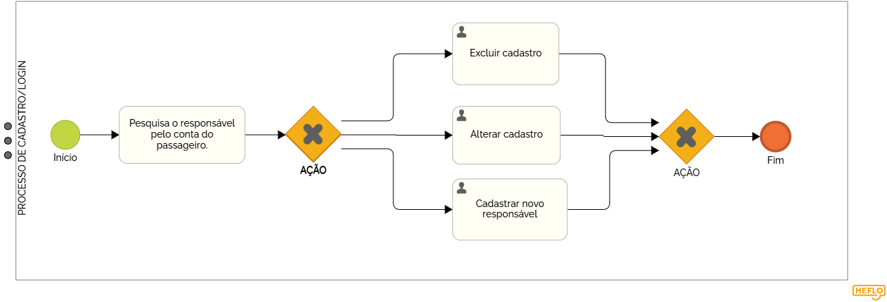

### 3.3.1 Processo 1 – GESTÃO DE CADASTRO E LOGIN

A gestão de cadastro e login é essencial para controlar o acesso ao sistema de gerenciamento de vans. No cadastro, o usuário cria uma conta com dados como nome, e-mail, telefone, cpf e uma senha de acesso. No login, ele usa essas informações para acessar o sistema de forma segura. 

#### Detalhamento das atividades

As pessoas que iram usar está aplicação (motorista, responsável, dono de rede de vans) terão que realizar o cadastro inicial, após o primeiro acesso será necessário entrar com o login para acessar ao site. Esse processo garante que apenas usuários autorizados possam usar o sistema, protegendo as informações e recursos importantes. Além de ajudar a idendificar quem está usando e levá-lo para a tela inicial correta. 

_Os tipos de dados a serem utilizados são:_

_* **Caixa de texto** - campo texto de uma linha_

_* **Número** - campo numérico_

_* **Seleção única** - campo com várias opções de valores que são mutuamente exclusivas (tradicional radio button ou combobox)_

_* **Link** - campo que armazena uma URL_

**Login**

| **Campo**       | **Tipo**         | **Restrições**         | **Valor default** |
| ---             | ---              | ---                    | ---               |
| login           | caixa de texto   | formato de e-mail      |                   |
| senha           | caixa de texto   | mínimo de 8 caracteres |                   |

| **Comandos**         |  **Destino**                   | **Tipo** |
| ---                  | ---                            | ---               |
| entrar               | Fim do Processo 1              | default           |
| cadastrar            | Início do proceso de cadastro  |                   |
| excluir              | Delete do cadastro             |                   |

**Cadastro**

| **Campo**                 | **Tipo**         | **Restrições**         | **Valor default** |
| ---                       | ---              | ---                    | ---               |
| login                     | caixa de texto   | formato de e-mail      |                   |
| senha                     | caixa de texto   | mínimo de 8 caracteres |                   |
| confirmar senha           | caixa de texto   | mínimo de 8 caracteres |                   |
| escolher qual perfil      | seleção única    | escolher apenas um     |                   |

| **Comandos**         |  **Destino**                   | **Tipo**          |
| ---                  | ---                            | ---               |
| entrar               | Fim do Processo 1              | default           |
| login                | Início do proceso de login     |                   |
| excluir              | Delete do cadastro             |                   |
