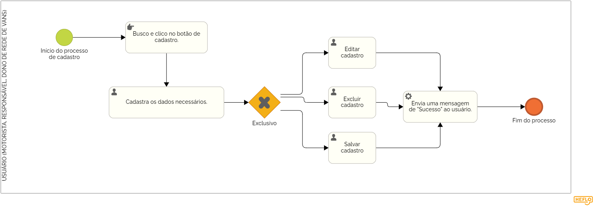

### 3.3.1 Processo 1 – GESTÃO DE CADASTRO

O login e o cadastro são etapas essenciais para acessar sites com segurança. No cadastro, você cria sua conta informando nome, e-mail ou telefone e uma senha forte. Já o login permite acessar sua conta inserindo o e-mail e a senha cadastrados. Caso esqueça a senha, é possível redefini-la pelo e-mail. Para facilitar o acesso, você pode salvar credenciais em um gerenciador de senhas. No sistema de WiseVan teremos três tipo de cadastro, cadastros para responsáveis, motoristas e dono de redes de vans. Caso o passageiro que irá na van seja menor de idade, ele será cadastrado em nome do seu responsável legal.

#### Detalhamento das atividades

Esse processo cuida do controle de acesso ao sistema. No cadastro, o usuário insere informações como nome, e-mail, telefone, CPF e senha. No login, esses dados são usados para autenticação. O sistema precisa garantir segurança e facilidade no acesso.  

### Atividades:  
- **Pesquisa de conta:** O sistema verifica se o passageiro já tem um responsável cadastrado.  
- **Ação de decisão:** O usuário pode excluir, alterar ou cadastrar um novo responsável.  
- **Atualização no sistema:** As mudanças são salvas e a conta fica pronta para uso.  
 

_Os tipos de dados a serem utilizados são:_

_* **Caixa de texto** - campo texto de uma linha_

_* **Número** - campo numérico_

_* **Seleção única** - campo com várias opções de valores que são mutuamente exclusivas (tradicional radio button ou combobox)_

_* **Link** - campo que armazena uma URL_

**Login**

| **Campo**       | **Tipo**         | **Restrições**         | **Valor default** |
| ---             | ---              | ---                    | ---               |
| login           | caixa de texto   | formato de e-mail      |                   |
| senha           | caixa de texto   | mínimo de 8 caracteres |                   |

| **Comandos**         |  **Destino**                   | **Tipo** |
| ---                  | ---                            | ---               |
| entrar               | Fim do Processo 1              | default           |
| cadastrar            | Início do proceso de cadastro  |                   |
| excluir              | Delete do cadastro             |                   |

**Cadastro**

| **Campo**                 | **Tipo**         | **Restrições**         | **Valor default** |
| ---                       | ---              | ---                    | ---               |
| login                     | caixa de texto   | formato de e-mail      |                   |
| senha                     | caixa de texto   | mínimo de 8 caracteres |                   |
| confirmar senha           | caixa de texto   | mínimo de 8 caracteres |                   |
| escolher qual perfil      | seleção única    | escolher apenas um     |                   |

| **Comandos**         |  **Destino**                   | **Tipo**          |
| ---                  | ---                            | ---               |
| entrar               | Fim do Processo 1              | default           |
| login                | Início do proceso de login     |                   |
| excluir              | Delete do cadastro             |                   |
