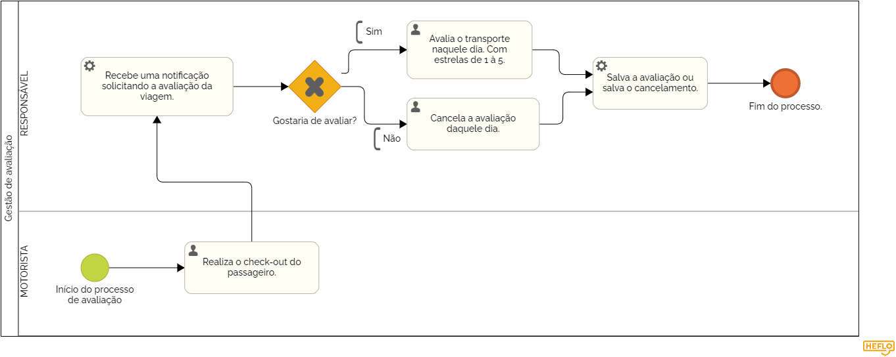

### 3.3.2 Processo 2 – Gestão de avaliações

A avaliação do transporte no dia será uma ferramenta essencial para medir a satisfação dos responsáveis e aprimorar a qualidade do atendimento. Na WiseVan após o motorista confirmar que deixou o passageiro no seu destino, o responsavél pela conta cadastrada receberá uma notificação com a opção de avaliar a experiência do dia, atribuindo uma nota de 1 a 5 estrelas e, em alguns casos, deixando um comentário detalhado.

As avaliações vão ajudar outros usuários a tomar decisões e escolher a van que irá se encaixar no seu perfil. Para os donos de redes de vans está avaliação diária permite que ele identifique pontos fortes e áreas de melhoria. Para garantir avaliações justas, nossa plataforma irá exigir que apenas usuários que realmente utilizaram o serviço possam avaliá-lo. 

Avaliar um serviço de forma clara e honesta contribui para a melhoria contínua da plataforma e para uma experiência mais confiável para todos os usuários.

#### Detalhamento das atividades

O sistema permite que passageiros avaliem suas viagens, garantindo um feedback contínuo para melhorar o serviço. As notas variam de 1 a 5 estrelas.  

### Atividades:  
- **Recebimento de solicitação:** O passageiro recebe uma mensagem pedindo avaliação após o check-out da viagem.  
- **Escolha da ação:** O usuário pode confirmar, editar ou excluir sua avaliação.  
- **Registro no sistema:** O feedback é salvo e pode ser consultado pelos responsáveis pela gestão do transporte.  

_Os tipos de dados a serem utilizados são:_

_* **Seleção múltipla** - campo com várias opções que podem ser selecionadas mutuamente (tradicional checkbox ou listbox)_

**Avaliação**

| **Campo**             | **Tipo**           | **Restrições**         | **Valor default** |
| ---                   | ---                | ---                    | ---               |
| estrelas de avaliação | seleção múltipla   | formato de seleção     |  default          |

| **Comandos**         |  **Destino**                   | **Tipo** |
| ---                  | ---                            | ---               |
| confirmar            | Fim do Processo 2              | default           |
| editar               | Início do proceso de editar    |                   |
| excluir              | Início do proceso de deletar   |                   |

