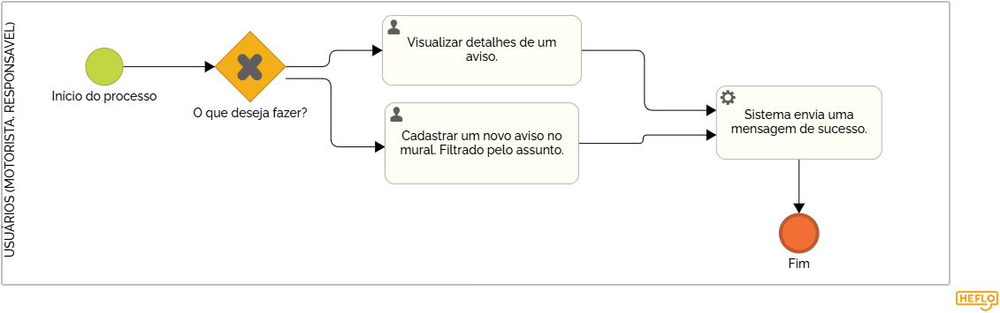
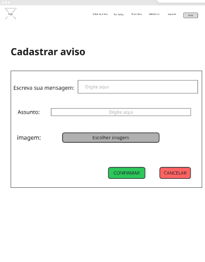
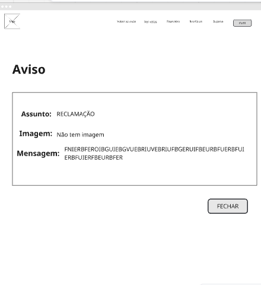
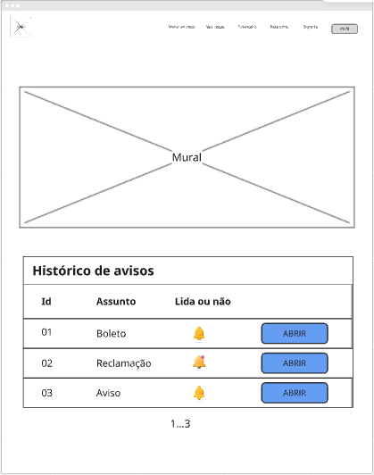

### 3.3.3 Processo 3 – Gestão mural de avisos

O sistema da WiseVan conta com um mural que funciona como um espaço aberto para que usuários deixem mensagens de aviso, sugestões ou reclamações sobre suas experiências. Nele, os responsáveis, motoristas e os donos de redes de vans podem colocar avisos sobre aumento de mensalidade, sobre atrasos, relatar problemas, sugerir melhorias ou elogiar um bom atendimento.

As mensagens são organizadas por categorias, como reclamações, dúvidas e feedbacks positivos, facilitando a leitura e a resposta por parte dos leitores. Não será possivél interagir com o aviso, apenas fazer a leitura do mesmo.

Esse mural não só dá voz aos usuários, mas também ajuda a melhorar os serviços oferecidos, criando uma experiência mais transparente e confiável para todos.

#### Detalhamento das atividades

O mural de avisos é aberto para todos os usuários, ele tem a funcionalidade de visualizar ou cadastrar um aviso. 

### Atividades:  
- **Acesso ao mural:** O usuário abre o mural no sistema.  
- **Decisão de escolha:** O usuário escolher o que deseja, se vai abrir o aviso dado no mural ou se deseja acressentar um novo aviso.  
- **Envio de mensagem:** O sistema faz o envio da mensagem.  

_Os tipos de dados a serem utilizados são:_

_**Área de texto** - campo texto de múltiplas linhas_
_**

**Mural**

| **Campo**       | **Tipo**         | **Restrições**                     | **Valor default** |
| ---             | ---              | ---                                | ---               |
| Aviso           | Área de Texto    | Deve ter no mínimo 10 caracteres   |                   |

| **Comandos**         |  **Destino**                   | **Tipo** |
| ---                  | ---                            | ---               |
| Adicionar            | Mural Atualizado               | Default           |
| Editar               | Início do proceso de edição    | Ação              |
| Excluir              | Início do proceso de exclusão  | Ação              |

#### **Tela para cadastrar no mural**

#### **Tela para visualizar avisos do mural**

#### **Tela para visualizar o mural**

