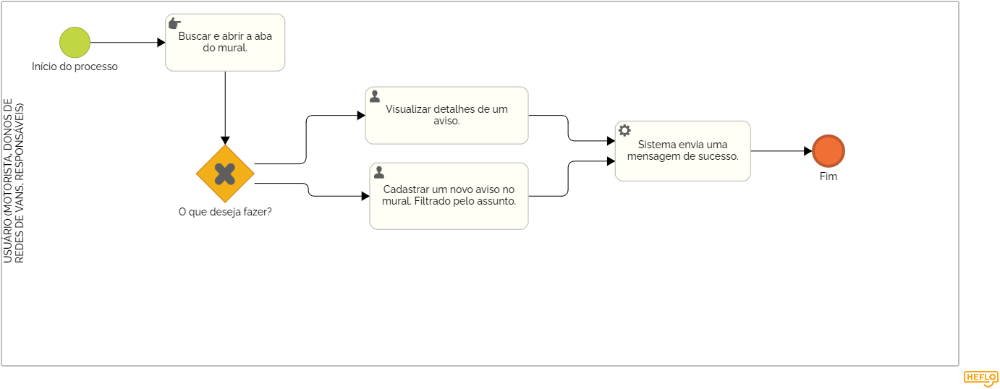

### 3.3.3 Processo 3 – Gestão mural de avisos

O sistema da WiseVan conta com um mural que funciona como um espaço aberto para que usuários deixem mensagens de aviso, sugestões ou reclamações sobre suas experiências. Nele, os responsáveis, motoristas e os donos de redes de vans podem colocar avisos sobre aumento de mensalidade, sobre atrasos, relatar problemas, sugerir melhorias ou elogiar um bom atendimento.

As mensagens são organizadas por categorias, como reclamações, dúvidas e feedbacks positivos, facilitando a leitura e a resposta por parte dos leitores. Não será possivél interagir com o aviso, apenas fazer a leitura do mesmo.

Esse mural não só dá voz aos usuários, mas também ajuda a melhorar os serviços oferecidos, criando uma experiência mais transparente e confiável para todos.

#### Detalhamento das atividades

Esse mural é um canal de comunicação direta para que usuários relatem problemas, façam sugestões ou acompanhem comunicados importantes.  

### Atividades:  
- **Envio de mensagem:** O usuário escreve e publica uma reclamação ou aviso.  
- **Interação com a mensagem:** Outros usuários podem adicionar respostas, editar ou excluir conteúdos.  
- **Registro da atualização:** As interações ficam armazenadas e disponíveis para consulta.  

_Os tipos de dados a serem utilizados são:_

_* **Área de texto** - campo texto de múltiplas linhas_

**Mural**

| **Campo**       | **Tipo**         | **Restrições**         | **Valor default** |
| ---             | ---              | ---                    | ---               |
| aviso           | Caixa de Texto   | formato de mensagem    |                   |

| **Comandos**         |  **Destino**                   | **Tipo** |
| ---                  | ---                            | ---               |
| adicionar            | Fim do Processo 3              | default           |
| editar               | Início do proceso de editar    |                   |
| excluir              | Início do proceso de excluir   |                   |
