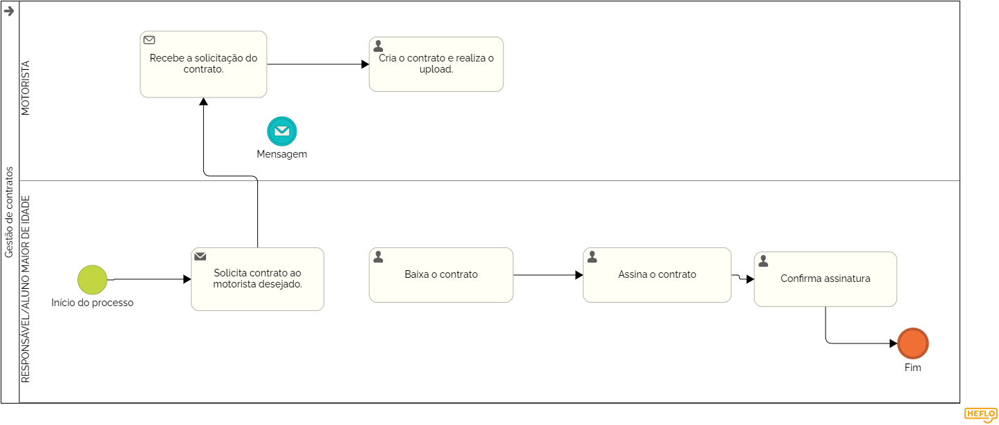
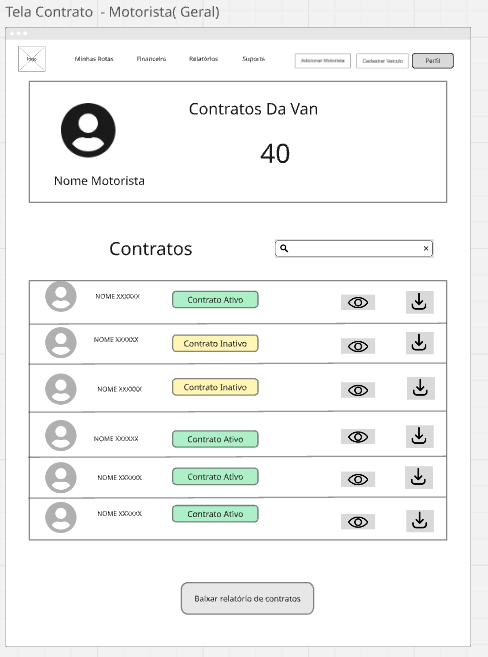
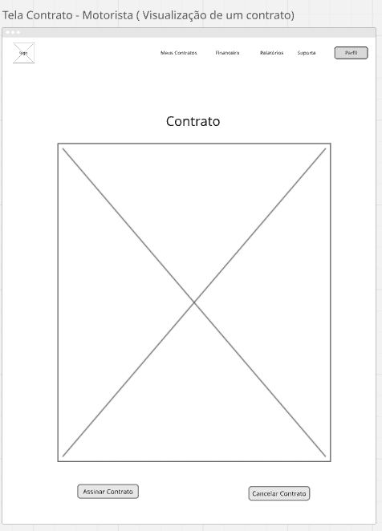
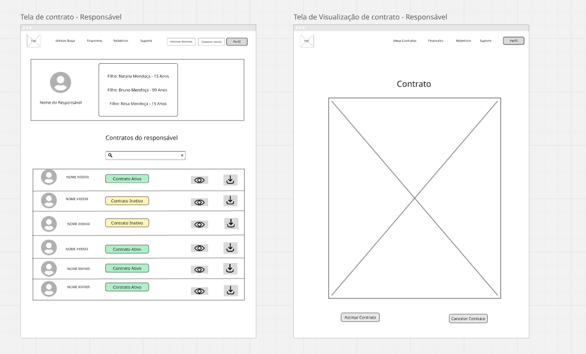
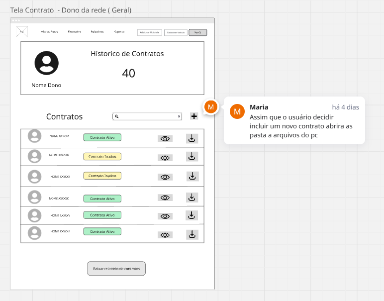
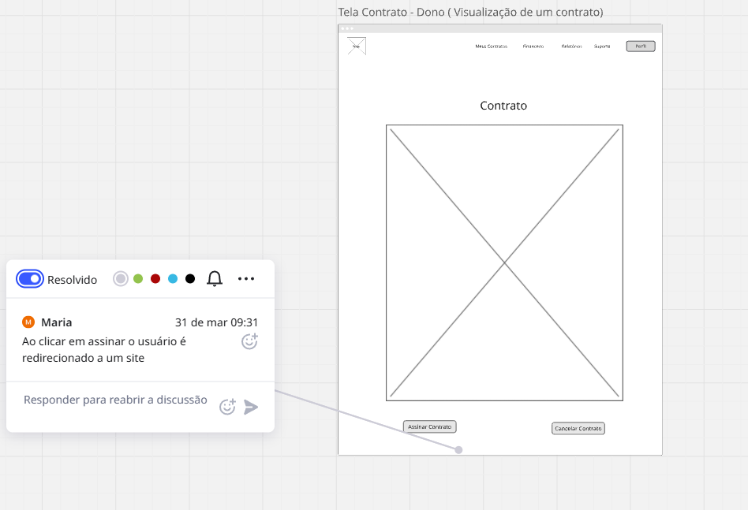

### 3.3.4 Processo 4 – Gestão de contratos

Os contratos de vans são importantes para garantir segurança, transparência e organização no transporte. Eles estabelecem direitos e deveres dos motoristas e passageiros, definindo valores, rotas, horários e responsabilidades. Além disso, ajudam a evitar problemas como cancelamentos inesperados, cobranças indevidas e falta de compromisso, trazendo mais confiança para ambas as partes.  

Na WiseVan fazer o contrato entre responsável e motorista é fácil e objetivo. O responsável consegue assinar pela própria plataforma ou cancelar a solicitação feita, além de conseguir ler todo o contrato. Para o motorista, ele precisará apenas subir o arquivo de contrato e selecionar a pessoa que deseja. Quando for feito a assinatura perguntará dados que não estão salvos no cadastro, apenas para fins de segurança. O restantes dos dados serão retirados do cadastro feito pelo próprio usuário. 

#### Detalhamento das atividades

Na gestão de contratos, o cliente solicita ao motorista o contrato, após receber, o cliente visualiza e decide se quer ou não assinar, caso assine, o motorista recebe o contrato de volta assinado, assim finalizando o processo.

### Atividades:  
- **Solicitação do contrato:** O passageiro solicita um contrato ao motorista.  
- **Criação do contrato:** O motorista gera um documento com as informações acordadas.  
- **Envio do contrato:** O motorista envia o contrato para o cliente.
- **Decisão do Passageiro:** O passageiro decide se quer ou não assinar o contrato.
  
_**Os tipos de dados a serem utilizados são:**_

_**Arquivo** - campo de upload de contrato em formato PDF_

_**Link** - campo que armazena uma URL_

* Caixa de texto - campo texto de uma linha

* Número - campo numérico

* Seleção única - campo com várias opções de valores que são mutuamente exclusivas (tradicional radio button ou combobox)

** Nova Contratação**

| **Campo**       | **Tipo**         | **Restrições**         | **Valor default** |
| ---             | ---              | ---                    | ---               |
| Nome            | Texto            |                        |                   |
| Email           | email            | ser um email valido  @ |                   |
| Buscar          | texto            |                        |                   |

**Comandos**
| **Comandos**         |  **Destino**                   | **Tipo**          |
| ---                  | ---                            | ---               |
| Novo      Contrato   | Inicio do processo             | Ação              |
| Cadastrar Contrato   | Fim do processo e salva        | Ação              |
| Fechar               | Cancela o cadastro             | Ação              |

#### **Tela para visualizar todos os contratos do motoristas**

#### **Tela para vizualizar um contrato específico do motoristas**

#### **Tela para vizualizar contratos vinculado ao Responsável**

#### **Tela para visualizar todos os contratos do dono da rede**

#### **Tela para vizualizar um contrato específico do dono da rede**

