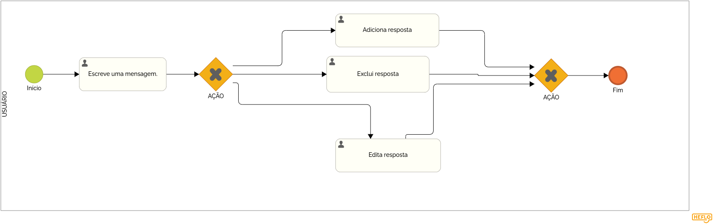

### 3.3.4 Processo 4 – Gestão de contratos

A gestão de contratos entre um motorista de van e o passageiro envolve a organização e o controle das condições acordadas entre as duas partes. Isso pode incluir o valor da viagem, horários, destinos, regras de segurança e outros detalhes importantes. O objetivo da gestão é garantir que ambas as partes cumpram o que foi combinado, proporcionando uma experiência segura e eficiente para o passageiro e um serviço adequado por parte do motorista. A gestão do contrato pode envolver a negociação de termos, a formalização de acordos e o acompanhamento do cumprimento das condições acordadas.

#### Detalhamento das atividades

O mural tem como principal objetivo uma comunicação simples e objetiva entre os usuários, eles serão avisados atrás de uma notificação quando for enviado uma nova informação no mural.

_Os tipos de dados a serem utilizados são:_

_* **Área de texto** - campo texto de múltiplas linhas_

**Mural**

| **Campo**       | **Tipo**         | **Restrições**         | **Valor default** |
| ---             | ---              | ---                    | ---               |
| aviso           | Caixa de Texto   | formato de mensagem    |                   |

| **Comandos**         |  **Destino**                   | **Tipo** |
| ---                  | ---                            | ---               |
| adicionar            | Fim do Processo 3              | default           |
| editar               | Início do proceso de editar    |                   |
| excluir              | Início do proceso de excluir   |                   |
