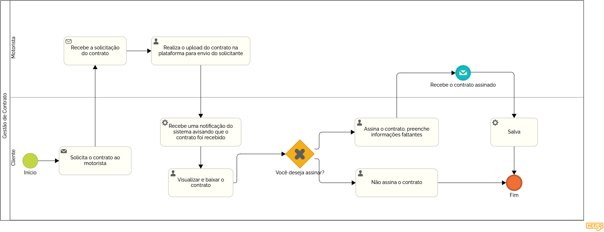

### 3.3.4 Processo 4 – Gestão de contratos

Os contratos de vans são importantes para garantir segurança, transparência e organização no transporte. Eles estabelecem direitos e deveres dos motoristas e passageiros, definindo valores, rotas, horários e responsabilidades. Além disso, ajudam a evitar problemas como cancelamentos inesperados, cobranças indevidas e falta de compromisso, trazendo mais confiança para ambas as partes.  

Na WiseVan fazer o contrato entre responsável e motorista é fácil e objetivo. O responsável consegue assinar pela própria plataforma ou cancelar a solicitação feita, além de conseguir ler todo o contrato. Para o motorista, ele precisará apenas subir o arquivo de contrato e selecionar a pessoa que deseja. Quando for feito a assinatura perguntará dados que não estão salvos no cadastro, apenas para fins de segurança. O restantes dos dados serão retirados do cadastro feito pelo próprio usuário. 

#### Detalhamento das atividades

Garante que os termos entre motoristas e passageiros sejam formalizados e cumpridos. Isso inclui valores, horários, regras de segurança e outros detalhes.  

### Atividades:  
- **Solicitação do contrato:** O passageiro solicita um contrato ao motorista.  
- **Criação do contrato:** O motorista gera um documento com as informações acordadas.  
- **Envio e assinatura:** O passageiro recebe, lê e assina o contrato.  
_Os tipos de dados a serem utilizados são:_

_* **Arquivo** - campo de upload de documento_

_* **Link** - campo que armazena uma URL_

**Contratação**

| **Campo**       | **Tipo**         | **Restrições**         | **Valor default** |
| ---             | ---              | ---                    | ---               |
| arquivo         | arquivo          | formato de pdf         |                   |

| **Comandos**         |  **Destino**                   | **Tipo** |
| ---                  | ---                            | ---               |
| assinar              | Fim do Processo 4              | default           |
