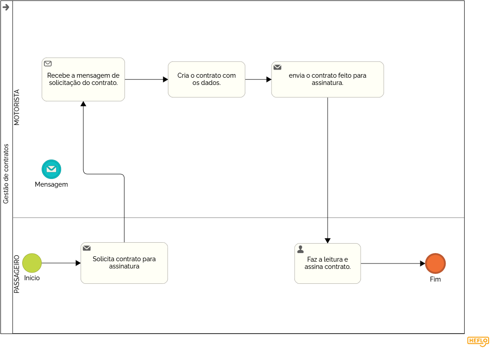

### 3.3.4 Processo 4 – Gestão de contratos

A gestão de contratos entre um motorista de van e o passageiro envolve a organização e o controle das condições acordadas entre as duas partes. Isso pode incluir o valor da viagem, horários, destinos, regras de segurança e outros detalhes importantes. O objetivo da gestão é garantir que ambas as partes cumpram o que foi combinado, proporcionando uma experiência segura e eficiente para o passageiro e um serviço adequado por parte do motorista. A gestão do contrato pode envolver a negociação de termos, a formalização de acordos e o acompanhamento do cumprimento das condições acordadas.

#### Detalhamento das atividades

O passageiro que deseja ir na van, após uma negóciação deve enviar um pedido pelo contrato que é enviado de forma automática pelo sistema, após a assinatura o contrato entra no nosso banco de dados e o passageiro está registrado dentro da van desejada. 

_Os tipos de dados a serem utilizados são:_

_* **Arquivo** - campo de upload de documento_

_* **Link** - campo que armazena uma URL_

**Contratação**

| **Campo**       | **Tipo**         | **Restrições**         | **Valor default** |
| ---             | ---              | ---                    | ---               |
| arquivo         | arquivo          | formato de pdf         |                   |

| **Comandos**         |  **Destino**                   | **Tipo** |
| ---                  | ---                            | ---               |
| assinar              | Fim do Processo 4              | default           |
