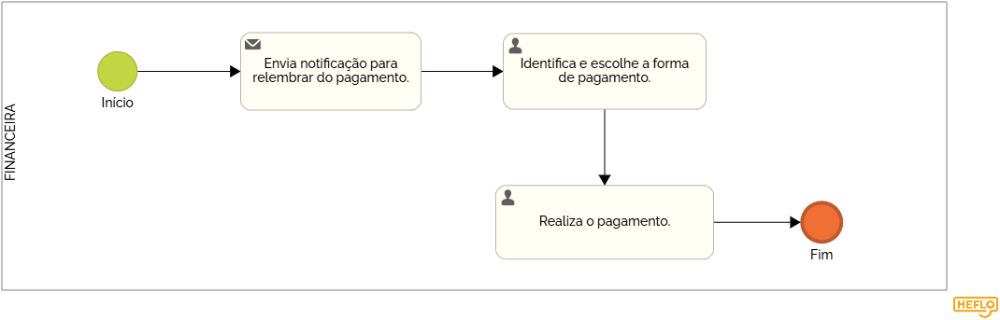

### 3.3.5 Processo 5 – Gestão financeira.

A gestão financeira de vans com passageiros, focada em pagamentos via boletos bancários ou Pix, é responsável pelo controle e organização dos pagamentos realizados pelos passageiros, garantindo a 
regularidade dos recebimentos e a precisão nas transações financeiras. Essa atividade envolve o gerenciamento das formas de pagamento, a emissão de boletos, o monitoramento dos pagamentos realizados e a 
conciliação dos valores recebidos com os serviços prestados.

#### Detalhamento das atividades
Permite que o passageiro informe diariamente se usará ou não o transporte, ajudando na organização das rotas.  

### Atividades:  
- **Solicitação da inclusão/exclusão:** O passageiro indica sua necessidade de transporte no dia.  
- **Criação do registro:** O motorista recebe a solicitação e ajusta a rota conforme necessário.  
- **Confirmação do status:** O passageiro recebe a confirmação do seu status no sistema.  
_Os tipos de dados a serem utilizados são:_

_* **Link** - campo que armazena uma URL_

**Pagamento**

| **Campo**       | **Tipo**         | **Restrições** | **Valor default** |
| ---             | ---              | ---            | ---               |
| link            | texto            |                |                   |

| **Comandos**         |  **Destino**                   | **Tipo**          |
| ---                  | ---                            | ---               |
| pagamento            | Fim do Processo 6              | default           |

