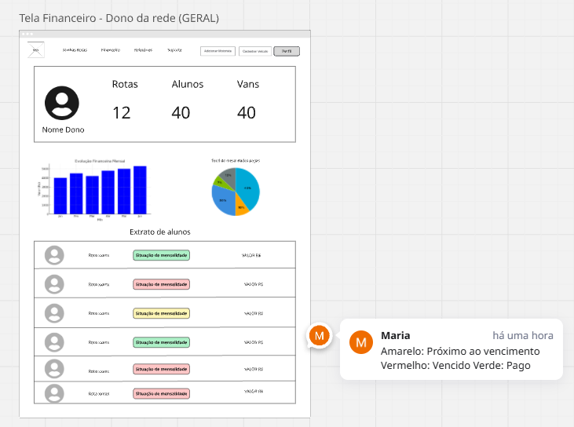
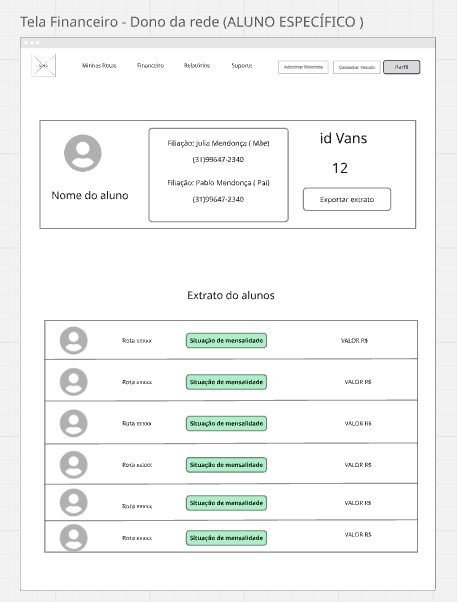
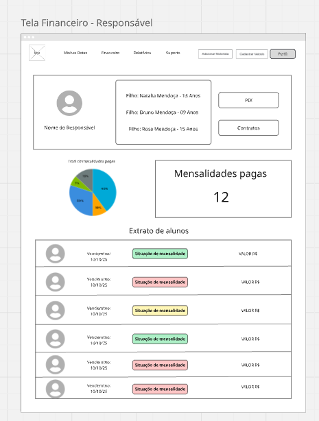
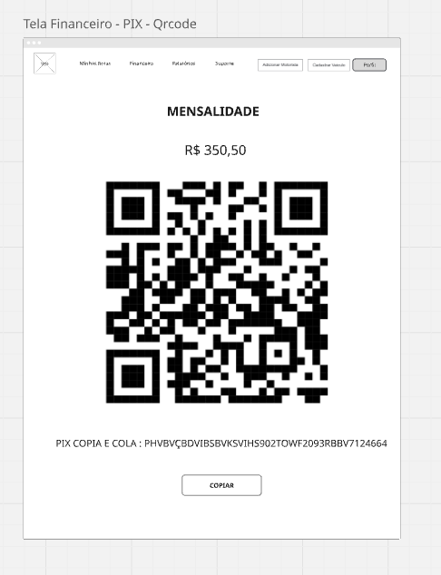

### 3.3.5 Processo 5 – Gestão financeira.

A gestão financeira é o processo no qual permite onde os passageiros façam o pagamento via Pix, onde tem o prazo de o 7º dia útil para efetuar o pagamento. 
Na tela do motorista, ele irá conseguir ter uma base de visualização das pendências por passageiro e também terá gráficos para analise de lucro e atrasos em mensalidades.

#### Detalhamento das atividades
Controla os pagamentos, garantindo que os valores sejam cobrados corretamente sem que haja atrasos e que inadimplências sejam evitadas.  

### Atividades:
#### Cliente: 
- **Abertura da aba de pagamento:** O passageiro acessa a área financeira do sistema.
- **Recebimento de cobrança**: O sistema gera e envia um aviso sobre o pagamento pendente.
- **Efetuação de pagamento**: Caso o pagamento seja realizado dentro do prazo, ele segue para a geração do comprovante.
- **Não Pagamento**: Se o passageiro não efetuar o pagamento dentro do prazo, o sistema pode tomar medidas adicionais, como reenvio da cobrança ou bloqueio do serviço.

#### Motorista:
- **Abertura da aba de pagamento:** O motorista acessa as informações financeiras.
- **Visualização de passageiros e status de pagamento:** Ele pode verificar quem está inadimplente.
- **Geração do PIX de pagamento:** O sistema gera um QR Code para facilitar o pagamento.
- **Confirmação do pagamento:** Se o pagamento for efetuado, o sistema gera um comprovante.
- **Notificação ao motorista:** O motorista recebe um alerta de que o pagamento foi realizado.
- **Atualização do status do passageiro:** O sistema marca o passageiro como "adimplente" e permite a continuidade do serviço.

#### Sistema:
- O sistema monitora pagamentos pendentes até o 7º dia útil.
- Após a confirmação do pagamento, ele gera o comprovante automaticamente.
- O sistema realiza a baixa no pagamento e altera o status do passageiro.

 
_Os tipos de dados a serem utilizados são:_

_* **Link** - campo que armazena uma URL_

**Pagamento**

| **Campo**          | **Tipo**         | **Restrições** | **Valor default** |
| ---                | ---              | ---                          | ---               |
| Link               | Texto            | 	URL válida                  |                   |
| Status do pagamento| Seleção única    | 	Pendente, Pago, Atrasado    | Pendente          |

**Comandos**

| **Comandos**         |  **Destino**                   | **Tipo**          |
| ---                  | ---                            | ---               |
| Efetuar Pagamento    | Geração do comprovante         | Default           |
| Notificar Motorista  | Atualização do sistema         | Ação              |
| Finalizar Processo   | 	Fim do fluxo financeiro       | Ação              |

#### **Tela para visualizar extrato financeiro do dono da rede**

#### **Tela para visualizar extrato financeiro de um passageiro do dono da rede**

#### **Tela para visualizar extrato financeiro do responsável**

#### **Tela para visualizar QRCODE**

