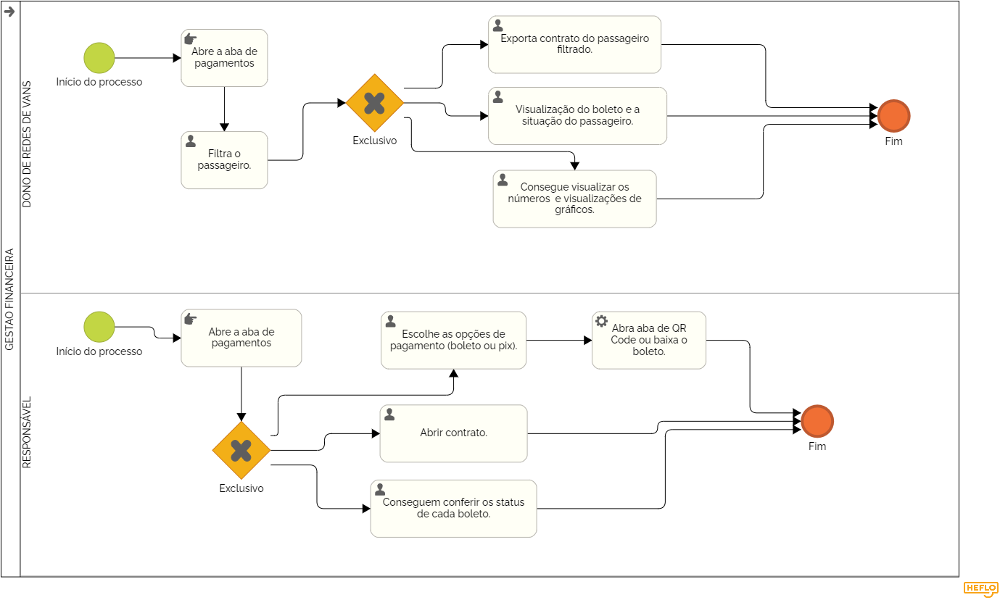

### 3.3.5 Processo 5 – Gestão financeira.

No sistema da WiseVan tem uma aba projetada para gerenciar pagamentos, recebimentos e transações de forma prática e segura. Irá permitir que os responsáveis realizem pagamentos por diferentes meios, como PIX ou boleto. O pagamento via PIX é especialmente popular por ser instantâneo e disponível 24/7, permitindo transferências rápidas entre contas bancárias com apenas um QR Code. Já os boletos geram documentos com valores e datas de vencimento, permitindo o pagamento em bancos, lotéricas ou por aplicativos, mas com o processamento podendo levar até três dias úteis. As telas também fornecem informações sobre os valores a serem recebidos, mostrando status da mensalidade e dando a opção de pagamento. 

Na tela do dono de redes de vans, ele irá conseguir ter uma base de visualização dos boletos por passageiro e também terá gráficos para analise de lucro e atrasos em mensalidades. 

#### Detalhamento das atividades
Controla os pagamentos, garantindo que os valores sejam cobrados corretamente e que inadimplências sejam evitadas.  

### Atividades:  
- **Envio de notificação:** O sistema lembra o passageiro sobre a data do pagamento.  
- **Escolha da forma de pagamento:** O usuário decide entre Pix, boleto ou outro método.  
- **Confirmação do pagamento:** O sistema registra a transação e mantém o histórico financeiro atualizado.  
 
_Os tipos de dados a serem utilizados são:_

_* **Link** - campo que armazena uma URL_

**Pagamento**

| **Campo**       | **Tipo**         | **Restrições** | **Valor default** |
| ---             | ---              | ---            | ---               |
| link            | texto            |                |                   |

| **Comandos**         |  **Destino**                   | **Tipo**          |
| ---                  | ---                            | ---               |
| pagamento            | Fim do Processo 6              | default           |

