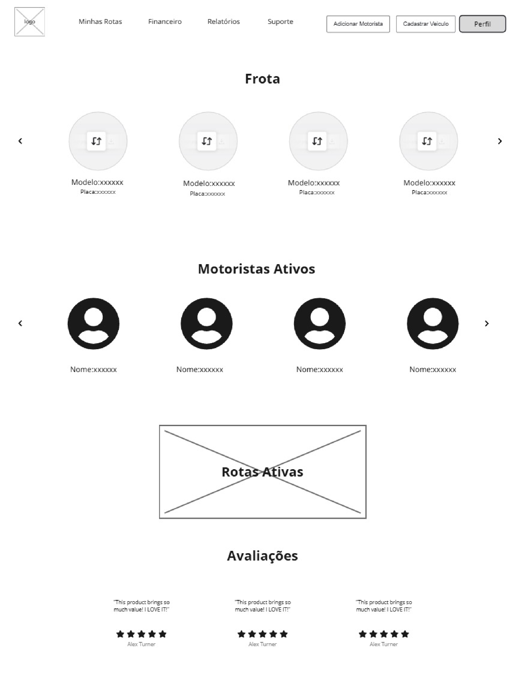
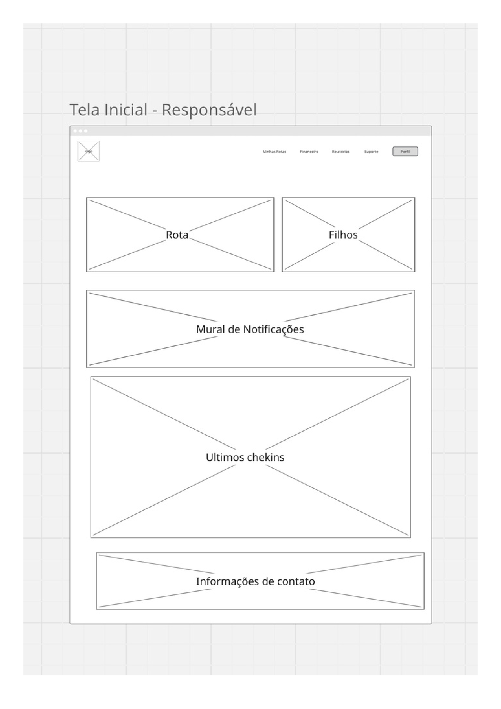
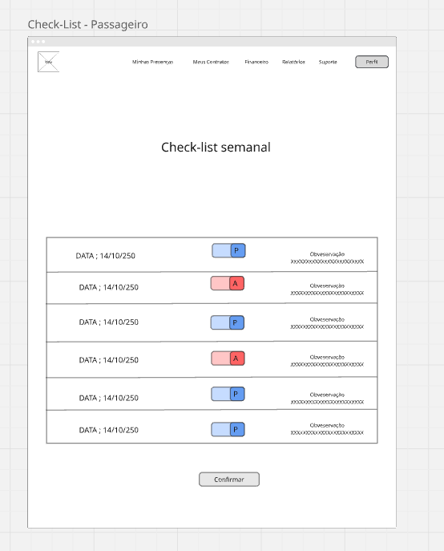
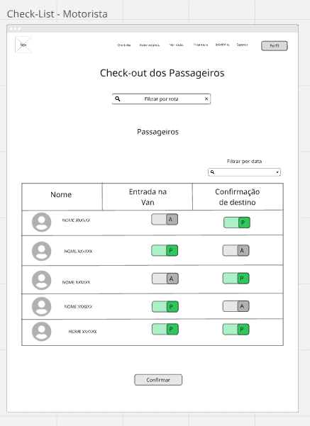

### 3.3.6 Processo 6 – Gestão de rota

A gestão de rotas é o processo de planejar, organizar e otimizar os trajetos de veículos para garantir eficiência, economia de tempo e recursos. Esse processo envolve o mapeamento das melhores rotas, levando em consideração fatores como distância, condições de tráfego, custos de combustível e tempo de viagem. Além disso, a gestão de rotas também envolve o monitoramento em tempo real. Na WiseVan permite que o motorista veja a sua rota após o check-in dos responsáveis. 

#### Detalhamento das atividades

Esse processo gerencia a confirmação de presença dos passageiros e a execução das rotas pelos motoristas.

### Atividades:  
- **Pesquisa da rota:** O motorista acessa o sistema para buscar a tela de rotas os passageiros confirmados para o dia.  
- **Ajuste do trajeto:** O sistema gera a rota com base nas confirmações feitas pelos os responsáveis.  
- **Confirmação de transportes:** O motorista registra no sistema a coleta e a chegada do passageiro ao destino.
- **Notificação de avaliação:** O sistema envia uma notificação para que o passageiro avalie o serviço.  

**Gestão de confirmações**

| **Campo**       | **Tipo**         | **Restrições**         | **Valor default** |
| ---             | ---              | ---                    | ---               |
| Presença        | Checkbox         | Obrigatório            | Não confirmado    |
| Data            | Data             | Formato válido         | Data atual        |
| Rota            | Texto            | Seleção de lista       | Nenhum            |

**Comandos**
| **Comandos**         |  **Destino**                   | **Tipo**          |
| ---                  | ---                            | ---               |
| Confirmar presença   | Gerar rota                     | Ação              |
| Iniciar Rota         | Notifica o motorista e salva   | Default           |
| Finalizar Rota       | Enviar notificação             | Ação              |

#### **Tela para visualizar tela incial do dono**

#### **Tela para visualizar tela incial do responsável**

#### **Tela de checkin responsável**

#### **Tela de checkin motorista**

