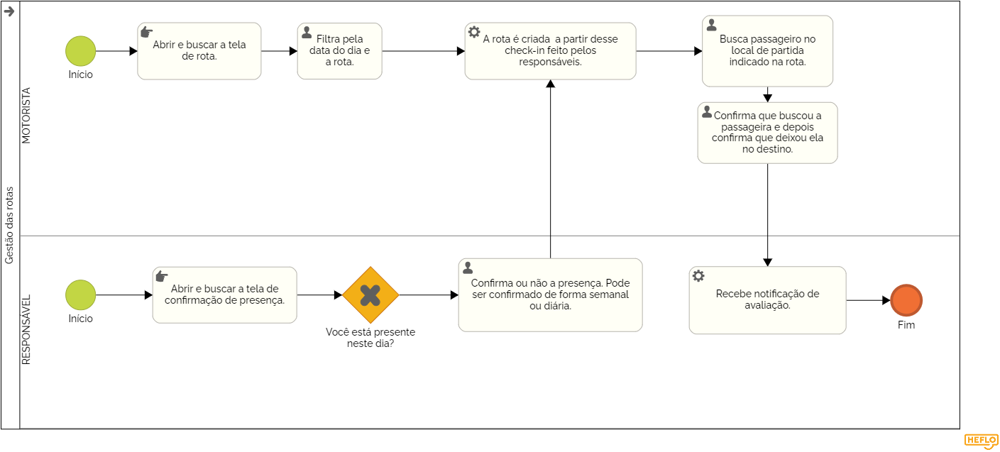

### 3.3.6 Processo 6 – Gestão de rota

A gestão de rotas é o processo de planejar, organizar e otimizar os trajetos de veículos para garantir eficiência, economia de tempo e recursos. Esse processo envolve o mapeamento das melhores rotas, levando em consideração fatores como distância, condições de tráfego, custos de combustível e tempo de viagem. Além disso, a gestão de rotas também envolve o monitoramento em tempo real. Na WiseVan permite que o motorista veja a sua rota após o check-in dos responsáveis. 

#### Detalhamento das atividades

Ajusta os trajetos diários com base no check-in dos passageiros, otimizando o percurso e reduzindo atrasos.  

### Atividades:  
- **Pesquisa da rota:** O motorista acessa o sistema para verificar quais passageiros confirmaram presença.  
- **Ajuste do trajeto:** O sistema sugere mudanças na rota conforme necessidade.  
- **Confirmação do itinerário:** O motorista recebe a versão final do percurso e segue para as coletas.  

