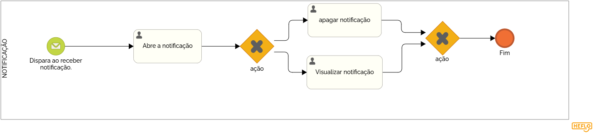

### 3.3.7 Processo 7 – Gestão de notificações

Usada para adminitrar as notificações recebidas, o usuário terá a opção de ver depois e responder depois também, mas também poderá ver e responder na mesma hora que for enviada. 

#### Detalhamento das atividades

1- Usuário recebe uma notificação. 
2- Escolhe se deseja abrir ou não.
3- Caso ele não abra a notificação, ficará salva dentro da aba de notificações "não lidas". 
4- Caso ele leia a notificação, ela ficará na aba de notificações "lidas". 

_Os tipos de dados a serem utilizados são:_

_* **imagem** - imagem_

**Notificação**

| **Campo**       | **Tipo**         | **Restrições**             | **Valor default** |
| ---             | ---              | ---                        | ---               |
| imagem          | img              | formato de notificação     |                   |

| **Comandos**         |  **Destino**                   | **Tipo** |
| ---                  | ---                            | ---               |
| visualizar           | Fim do Processo 7              | default           |
| excluir              | Inicia o processo de deletar   |                   |

