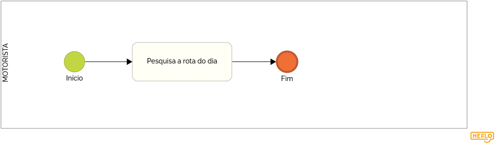

### 3.3.7 Processo 7 – Gestão de rota

A gestão de rotas baseada no check-in de alunos e passageiros é uma abordagem eficiente para otimizar o trajeto e garantir a organização no transporte. Nesse sistema, as rotas são criadas e ajustadas com base nas confirmações de presença de cada passageiro, como alunos ou outros passageiros que utilizarão o serviço de transporte.

#### Detalhamento das atividades

Ajusta os trajetos diários com base no check-in dos passageiros, otimizando o percurso e reduzindo atrasos.  

### Atividades:  
- **Pesquisa da rota:** O motorista acessa o sistema para verificar quais passageiros confirmaram presença.  
- **Ajuste do trajeto:** O sistema sugere mudanças na rota conforme necessidade.  
- **Confirmação do itinerário:** O motorista recebe a versão final do percurso e segue para as coletas.  

