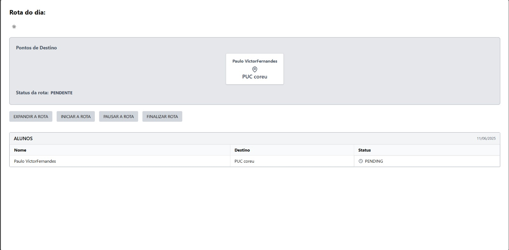

### 3.3.6 Processo 6 – Gestão de rota

A gestão de rotas é o processo de planejar, organizar e otimizar os trajetos de veículos para garantir eficiência, economia de tempo e recursos. Esse processo envolve o mapeamento das melhores rotas, levando em consideração fatores como distância, condições de tráfego, custos de combustível e tempo de viagem. Além disso, a gestão de rotas também envolve o monitoramento em tempo real. Na WiseVan permite que o motorista veja a sua rota após o check-in dos responsáveis. 

#### Detalhamento das atividades

Esse processo gerencia a confirmação de presença dos passageiros e a execução das rotas pelos motoristas.

### Atividades:  
- **Pesquisa da rota:** O motorista acessa o sistema para buscar a tela de rotas.  
- **Ajuste do trajeto:** O sistema gera a rota com base nas confirmações feitas pelos os responsáveis.  
- **Confirmação de transportes:** O motorista registra no sistema a coleta e a chegada do passageiro ao destino.

**Gestão de confirmações**

| **Campo**       | **Tipo**         | **Restrições**         | **Valor default** |
| ---             | ---              | ---                    | ---               |
| Presença        | Checkbox         | Obrigatório            | Nenhum            |
| Data            | Data             | Formato válido         | Data atual        |
| Horário         | Time             | Obrigatório            | Nenhum            |
| IdMotorista     | int              | Obrigatório            | Nenhum            |

**Comandos**
| **Comandos**         |  **Destino**                        | **Tipo**          |
| ---                  | ---                                 | ---               |
| Checkin              | Atualiza status da rota             | Ação              |
| Criar rota           | Cria uma nova  rota                 | Ação              |
| Ver rota             | Visualiza as informações da rota    | Ação              |
| Expandir a rota      | Abre a rota                         | Ação              |
| Inicia a rota        | Inicia a rota e atualiza o status   | Ação              |
| Pausar a rota        | Pausa a rota e atualiza o status    | Ação              |
| Finalizar rota       | finaliza a rota e atualiza o status | Ação              |

#### **Tela para criar a rota**

#### **Tela para visualizar tela incial do responsável**

#### **Tela de checkin responsável**

