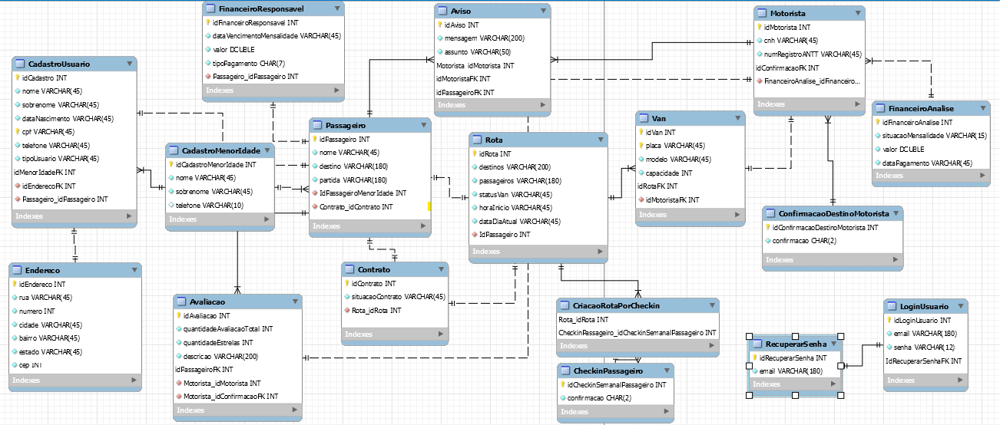

## 4. Projeto da solução

### 4.1. Modelo de dados

O modelo relacional da WiseVan descreve a estrutura de dados utilizada para gerenciar o transporte de passageiros de maneira eficiente. Nesse modelo, as principais entidades podem incluir Vans, Motoristas, Passageiros, Rotas, Pagamentos e Controle de Presença. 

A entidade Vans armazena informações sobre os veículos, como placa, modelo e capacidade. A Motorista relaciona-se com a Van, identificando quem está responsável por cada viagem, enquanto os Passageiros estão associados a uma Rota específica e ao Controle de Presença. A Rota define os trajetos, horários e pontos de partida e chegada. Pagamentos registram os valores pagos pelos passageiros, com informações sobre data, método de pagamento (como PIX ou boleto) e status do pagamento. 

Esse modelo garante um gerenciamento organizado, com todas as informações interconectadas, facilitando a operação do sistema de transporte.

---

### 4.2. Tecnologias

**1. Introdução**

Este relatório descreve as tecnologias e ferramentas adotadas pela equipe para o desenvolvimento do projeto, com foco em front end, back end, banco de dados, modelagem de dados e processos, além de controle de versão e gerenciamento de tarefas.

**2. Tecnologias de Front End**

A equipe utilizará **HTML, CSS e JavaScript, além de React, TypeScript, Tailwind CSS e a biblioteca Shadcn**. Essas tecnologias permitirão a criação de interfaces dinâmicas, responsivas e de fácil manutenção.

**3. Tecnologia de Back End**

No back end, será utilizado **Spring Boots com Java**, proporcionando uma plataforma robusta para o desenvolvimento de APIs e aplicações escaláveis.
- Spring Boot Starter Web: será usado para criação de aplicações web, com suporte para RESTful APIs.
- Spring Boot Starter Thymeleaf: Para aplicações web que precisam de uma camada de template para renderizar HTML dinâmico. Thymeleaf é o motor de templates padrão para Spring Boot.
- Spring Boot Starter Security: Para adicionar autenticação e controle de acesso em sua aplicação, incluindo autenticação via login.
- Spring Boot Starter Test:usado para testar, incluindo suporte para testes unitários e integração.
- Spring Boot Starter Mail: Para enviar e-mails a partir da sua aplicação, como confirmações de registro ou notificações.
- Spring Boot Starter Validation: Para validar dados, como entrada de formulários, usando anotações como @Valid e @NotNull.

**4. Ferramentas de Desenvolvimento**

**VS Code** será o editor de código, oferecendo um ambiente ágil e personalizável.
**GitHub** será usado para o controle de versão e para o gerenciamento de tarefas, aproveitando os quadros Kanban para organização do progresso do projeto.

**5. Banco de Dados**

O banco de dados adotado será o **MySQL**, garantindo uma solução confiável e eficiente para armazenamento de dados.

**6. Ferramentas de Modelagem**

**Miro** será utilizado para a criação de wireframes e protótipos colaborativos.
**Draw.io** será empregado na modelagem de dados e diagramas de arquitetura.
**Heflo** será utilizado para a modelagem de processos de negócios, permitindo a construção de diagramas de fluxo.

